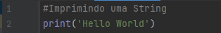
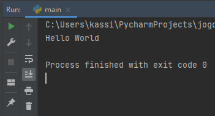
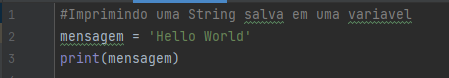
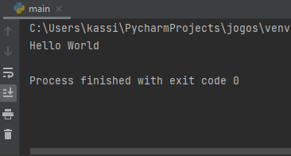
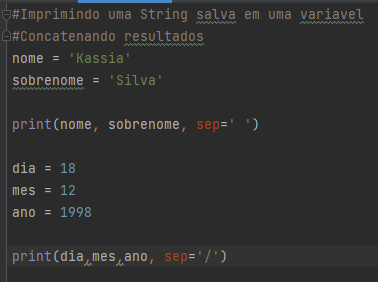
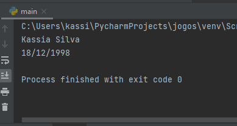

# Formação Python 

 <a href="https://cursos.alura.com.br/formacao-Python-linguagem">Alura - Formação Python</a>

Resumo teórico do conteúdo abordado

<h2>Sobre o Python</h2>

	<b>Python</b> é uma linguagem de programação interpretada de alto nível e que suporta múltiplos paradigmas de programação: imperativo, orientado a objetos e funcional. É uma linguagem com tipagem dinâmica e gerenciamento automático de memória.

 <b>Linguagem</b> Interpretada significa que a implementação do código Python em cada computador é feita a partir de um interpretador

 <b>Linguagem</b> de Alto Nível possui maior proximidade com a linguagem humana do que a linguagem de máquina(binário)

	<b>Suporta múltiplos paradigmas da computação:</b>
	
	Paradigmas de Programação são as diferentes abordagens que um programador pode utilizar para desenvolver um código e resolver uma questão específica.
		○ Imperativo ou Procedural: As instruções são passadas ao computador na sequência que devem ser executadas.
		○ Orientado a Objetos: Talvez o mais popular dos paradigmas. Utiliza estruturas denominadas classes e objetos e sua principal característica é permitir uma programação multiplataforma.
		○ Funcional: Possui como principal característica o uso de estruturas chamadas de funções. Essas funções separam o código em blocos nos quais cada um tem uma tarefa específica.

 <b>Possui tipagem dinâmica </b>

  Os tipos de dados não precisam ser definidos o próprio Python entende cada tipo informado.

 <b>Gerenciamento Automático de Memória:</b>

 O Python constantemente realiza uma manutenção ou “limpeza” da memória não utilizada através de mecanismos como o garbage collector (coletor de lixo) e a Reference Counting (Contagem de Referência).Dessa forma, o programador não tem que se preocupar em fazer um gerenciamento manual de memória.

 <b> Variáveis e String </b>

 <b>Variáveis</b> são usadas para armazenar valores. 

 Uma <b>String</b> é uma série de Caractere, entre aspas simples ou duplas

<b>Exemplos </b> 

 Entrada 

 Saida 

 Entrada 

 Saida 

 Entrada 

 Saida 

 <b> Funções </b> 
 

Para declarar funções em python devemos utilizar a palavra reservada def.
        O Consenso de nomeclatura do Python é snake_case
	
    def nome_da_funcao():
    # todo o código identado faz parte da função
        print("aprendendo funções")

